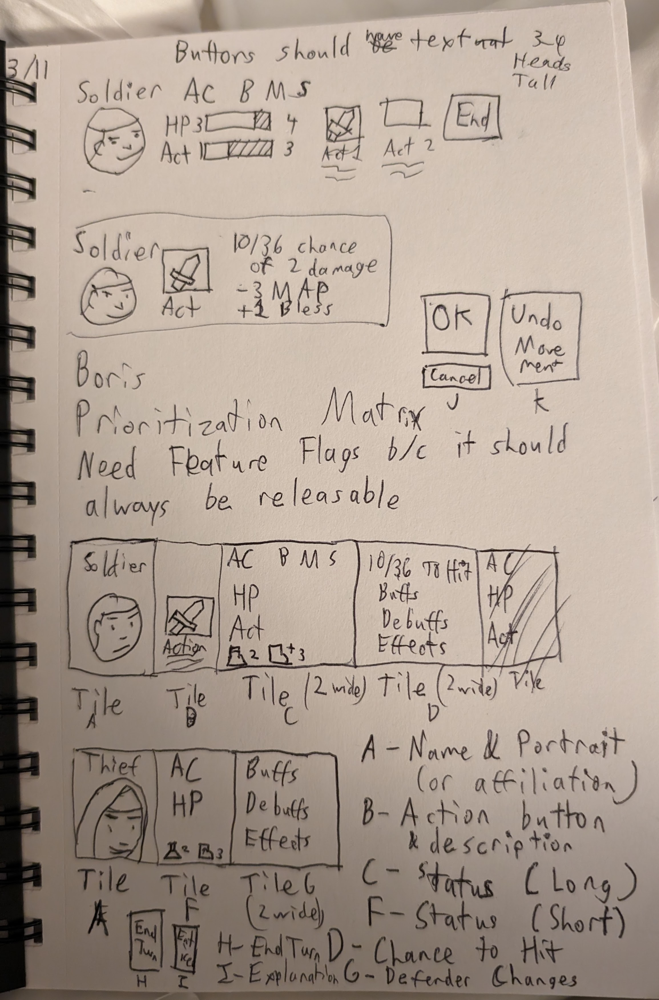
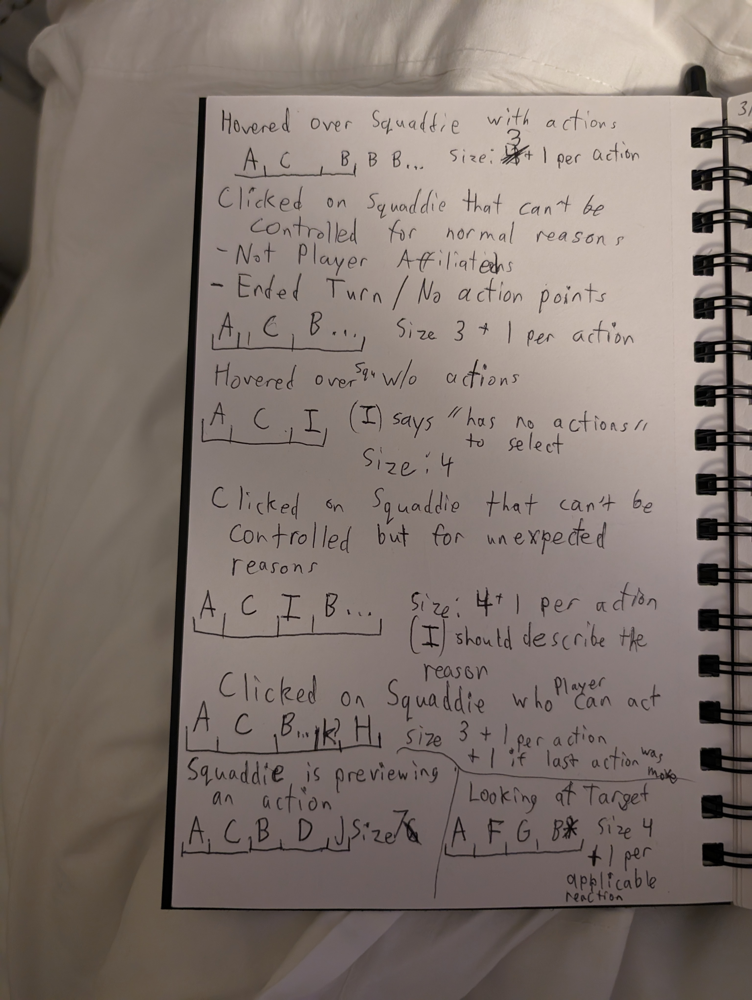

# New Player Selector UI
The old HUD was confusing. It didn't answer any questions players had.
We will need a rewrite of some kind.

To build this programmatically, we will combine several Tiles as a single Panel that will answer relevant questions.

## Sketches

## Panel
### A Hovered over squaddie with Actions
- Layout: `A_C___B*`
- Size: 3 + 1 additional per action

This panel appears when the Squaddie has actions.
The UI assumes most Squaddies have 3 or fewer actions.

This panel may appear in the center or right locations.

#### Answers:
- Who is this squaddie? What is their name and affiliation?
- What are this squaddie's basic stats?
- What actions can this squaddie perform?

### B Clicked on Squaddie that cannot be controlled (the player knows they can't control it)
- Squaddie is not on a Player team and lacks the Player Affiliation
- Squaddie has ended their turn and has no actions

- Layout: `A_C___B*`
- Size: 3 + 1 additional per action

This looks similar to Panel A, so we can transition seamlessly between the two.
This panel will appear on the left side.

#### Answers
- Who is this squaddie? What is their name and affiliation?
- What are this squaddie's basic stats?
- What actions can this squaddie perform?

### C Hovered over a Squaddie without Actions
- Layout: `A_C___I_`
- Size: 4

Tile I will probably say "No actions" or something like that.

#### Answers
- Who is this squaddie? What is their name and affiliation?
- What are this squaddie's basic stats?
- I don't see any actions, why?

### D Clicked on Squaddie that cannot be controlled (the player would control them in normal circumstances, but not right now)
- Layout: `A_C___I_B*`
- Size: 4 + 1 additional per action

This Panel is similar to Panels B and E, except the player expects to control the squaddie. 
Tile I will explain why that's not possible.

Examples include:
- "Enticed!" - the player cannot control this squaddie because they are temporarily enticed.
- "Stun recovery" - the squaddie lost all of their actions recovering from stun.

#### Answers
- Who is this squaddie? What is their name and affiliation?
- What are this squaddie's basic stats?
- Why can I not control this squaddie?

### E Clicked on a Squaddie who player can control
- Layout: `A_C___B*K?H_`
- Size: 4 + 1 additional per action + 1 if the last action was movement 

Tile K lets people cancel their movement. They can keep canceling until:
- They haven't performed any actions this turn
- The last action was not a movement

Clicking on the map creates a movement.

#### Answers
- I'd like to end my turn now
- Who was I controlling?
- Oh, it's still this squaddie's turn.
- I want to cancel my movement and move to somewhere else.

### F User is hovering over a target after selecting an action
This panel is usually 4 tiles wide, usually paired up with Panel G.
Note this is one of the few panels where the portrait is not first - I may have to mess with the panel order based on user feedback.

- Layout: `G___A_F_B*`
- Size: 4 + 1 per reaction

#### Answers
- How can my target reduce the chance of getting hit?
- Are there any reactions I need to worry about?

### G User is previewing an action after selecting the target but before confirming 
This is 7 tiles wide - the longest one. This is usually paired up with Panel F.

- Layout: `A_C__B_D_J_`
- Size: 7 tiles wide

#### Answers
- What is my chance of hitting?
- How much damage will I do?
- What buffs are helping me? What debuffs are hindering me?
- Which action did I use?

## Tiles
### A: Name and Portrait
- This tile shows the squaddie's name.
- If the character has a portrait, it will appear here.
- If the character lacks a portrait, show their team affiliation here.
- If there's room, show their affiliation if it's not player.

### B: Action description
- Show the action's name
- Show the action's symbol
- Show the basic cost/range/damage
You can reuse some of the info from the old HUD here.

### C: Status (Wide version, HP/Actions/Defenses)
This tile is 2 columns wide. Tile F is a 1 column version.
- Armor & Saving Throws serve as a small header on top
- HP show numbers and a horizontal bar
- Actions show a horizontal bar
- Show icons representing status ailments
You can reuse some of the info from the old HUD here.

You should be able to highlight the Action Point bar, to demonstrate what you'll lose upon using the action.

#### D: Chance to Hit
This tile is 2 columns wide.

- Show the chance to Hit (out of 36 or a % chance? Maybe both?)
- Show buffs & debuffs that effect the attacker's chance to hit (Tile G will show defenses)
- Show the effects of hitting (damage, ailments, death, maybe chance to critical) 

#### F: Status (Short version)
This is similar to C, except this is 1 tile wide.
- Armor & Saving Throws
- HP
- Status Ailment icons
No horizontal bars, especially action

This assumes the squaddie is not going to act, usually reserved for squaddies who cannot move during this phase.

#### G: Defender Changes Chance to Hit
This tile is 2 columns wide.

- Show buffs & debuffs that effect the defender's chance to miss (Tile D will show offense)
- Show any relevant effects that reduce damage and ailments (temp HP, poison immunity, etc.)

#### H: End Turn
The end turn action, similar to tile B, but it doesn't need an action.

#### I: Abnormal Behavior Explanation
This is a text-only catch all designed to explain why the round is abnormal.
Examples:
- "No actions are available" - squaddie was created without actions
- "Enticed!" - the player cannot control this squaddie because they are temporarily enticed.

#### J: OK/Cancel
This tile houses 2 buttons:
- OK: Confirm using the action against this target
- Cancel: Cancel using the action against this target

### K: Undo Movement
Like tile H, this houses a single button.
The button can be clicked to undo the squaddie's most recent movement action.
