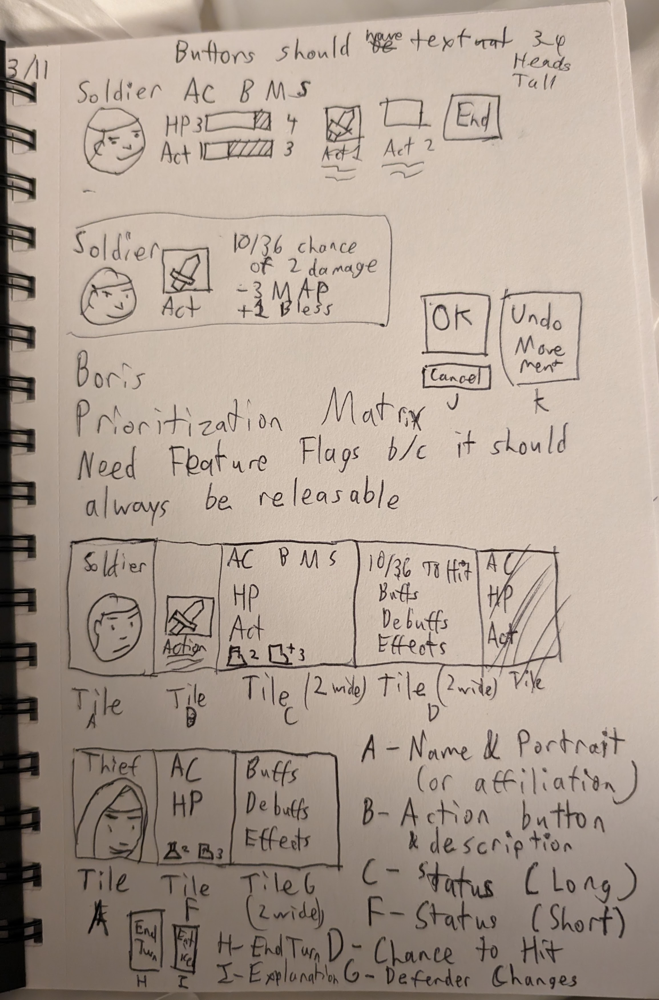

# Extracting the UI
## Problem
The current UI isn't useful. We need to present information that users need.

The challenge lies in gradually changing UI. We should always be ready to release, even if we are partway through development.

### Tile Arrangement

The plan is to replace the current squaddie HUD with a new one, based on new HUD handler
that can arrange Tiles to create a Panel.

This panel will always be drawn at the bottom of the screen, so it would take up the same position as the old one.

## Solution: Feature flag with an in-game toggle
A feature flag will allow me to gradually develop the new UI while adding bug fixes and other features to the app.

In both development and production, we use the older HUD. This way when it's released people can still play the game.

In development, there is a button that can toggle the HUD. With the old mode we can match production's performance, but 
we can also switch and test the new HUD out.

## Solution: Extract the Save/Load buttons
Save & Load were part of the old HUD. This muddled the HUD's purpose and made it too confusing.

File Access is controlled by different mechanisms and are a different domain. To ensure the new HUD doesn't have to replicate
the functionality, we split the file access into its own HUD element and put it on top of the screen.

This benefits both the old and new HUDs.

## What now?
We are able to develop the new HUD under the covers. It's going to take a while to develop the new HUD.
