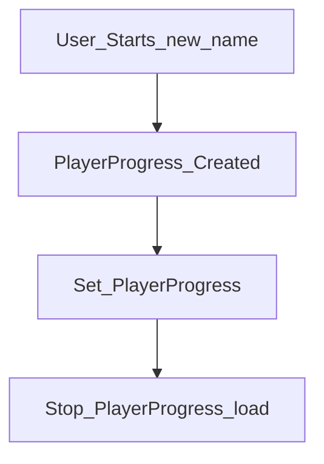
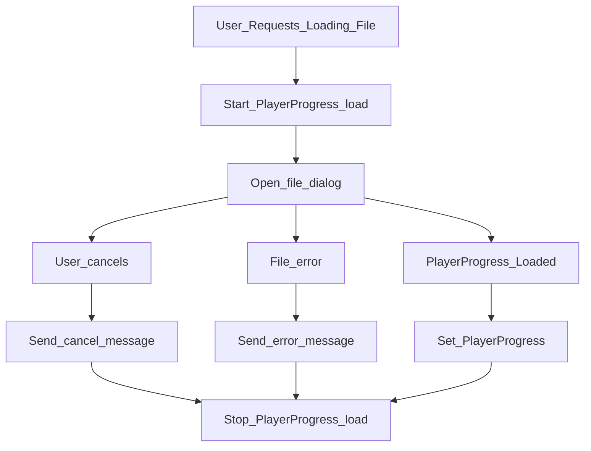
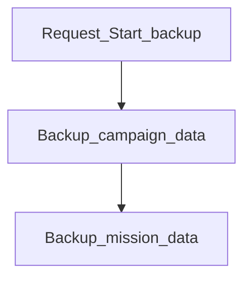
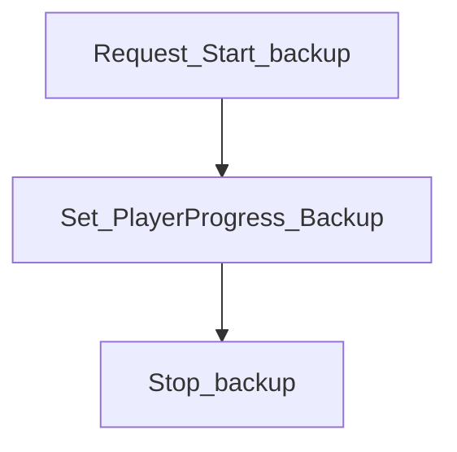
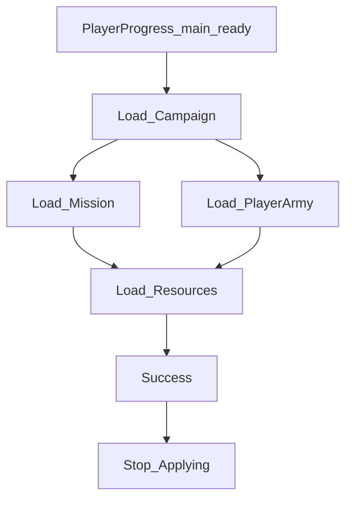
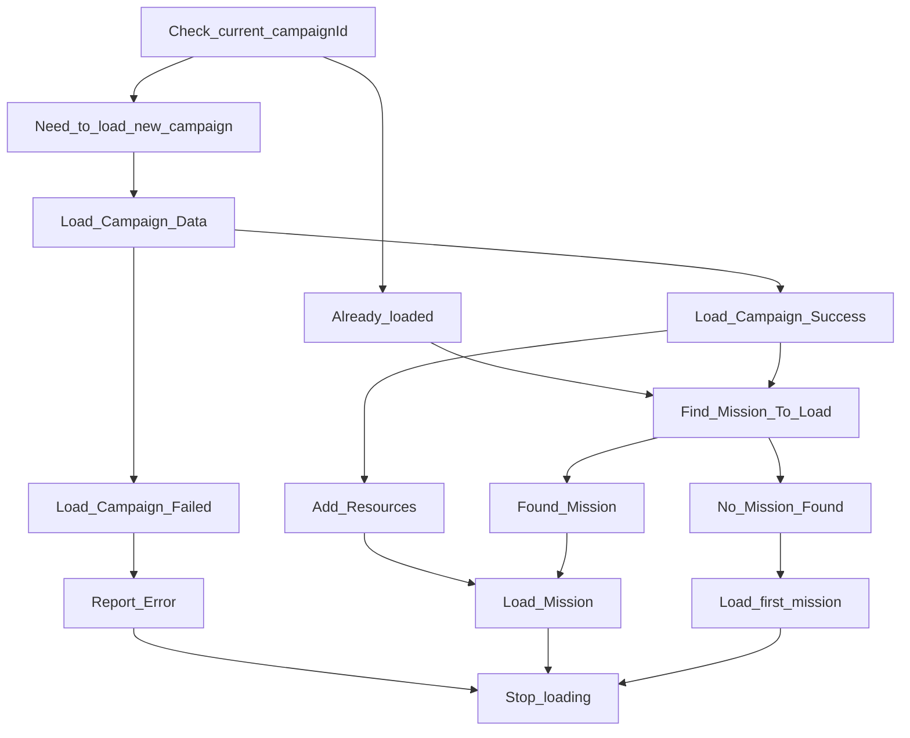
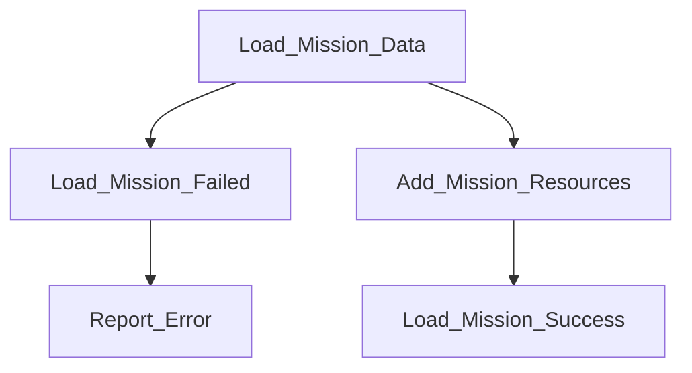
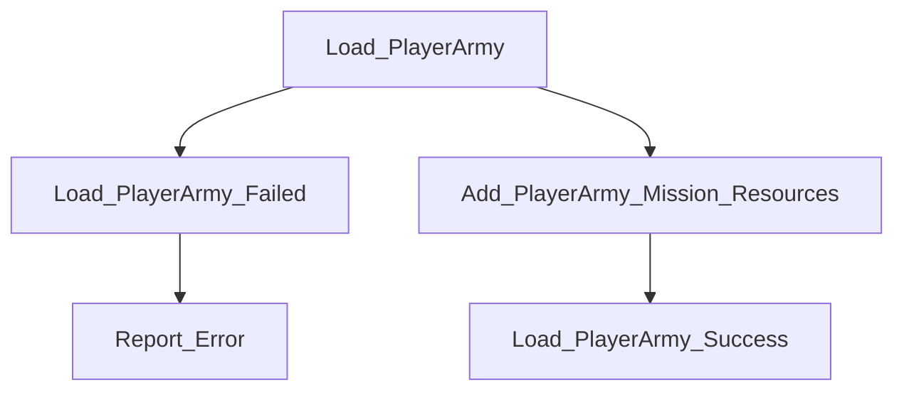
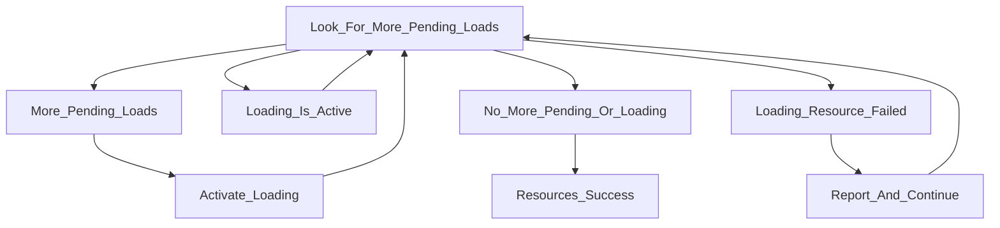

# Loading the game state
This is a multistep process that retrieves multiple resources and may fail due to bad versions or invalid state.

We also want this to run concurrently with the game.

If no progress is given, we'll load the title screen.

# Loading PlayerProgress file
## Game loads new game
When the player starts the game, we need to load the campaign.

Create an empty PlayerProgress object. Populate the load state with it.

## User loads PlayerProgress file
The user specifies they want to load a file noting the progress they made through the game.
They may click on a Load Progress button on any menu that has one.
- Open a file dialog so they can pick the file.
- The user may cancel. Send a message they did and stop trying to load. 
- The file may fail to open (not JSON, I/O failure, etc.). Send a message about the failure and stop trying to load.

If the message loads properly, populate the load state with the loaded PlayerProgress.

# PlayerProgress File Is set
Now that the player progress is set, we need to change the game state to match it.
No matter what, we'll make a backup of the state just in case we need to revert it all.

## Backup game state
We need to ask all the subsystems to back up their progress.

We'll make a PlayerProgress object as the backup, and ask each active subsystem to save to it.

# Restore backup game state
We made a PlayerProgress as the backup, so we just tell the loader to use the backup file to load.

# Applying PlayerProgress
Depending on what subsystems are present, we'll keep trying to load until it is exhausted.
If any part fails, we'll try to Restore the backup game state.
If the backup fails, we'll create a blank PlayerProgress and load the title screen.

We can load the mission and player army at the same time, but we'll wait to load resources until both complete.

## Applying PlayerProgress Main File

## Load Campaign
We may have already loaded the campaign (we're in the same campaign, and we roll back to a previous mission.)
The campaign may also not be loaded yet.
In both situations, we'll try to retrieve it from storage.
Otherwise, we can skip loading the campaign file (but we have to check on other resources.)

### Load Mission
Actually loading the game state requires loading the mission data, the player's army, and then trying to place everything.
It's easier if I just reload the mission no matter what, that way I don't have to deal with state.
Once that's done, load the player army.

### Load Player Army
The player army consists of the built-in teammates. Later it will handle leveling up and applying it to their level ups.

## Loading Resources
These are media files we need to load, usually images. All of this is asynchronous, so we'll have to wait for everything to load.

Files may fail to load. Right now we have a naive approach that assumes 1 attempt is all we need. We'll add retries and a dead letter queue later on.

We may mark resources as necessary in the future so if they fail this step fails. But for now we just poll until they all complete.

